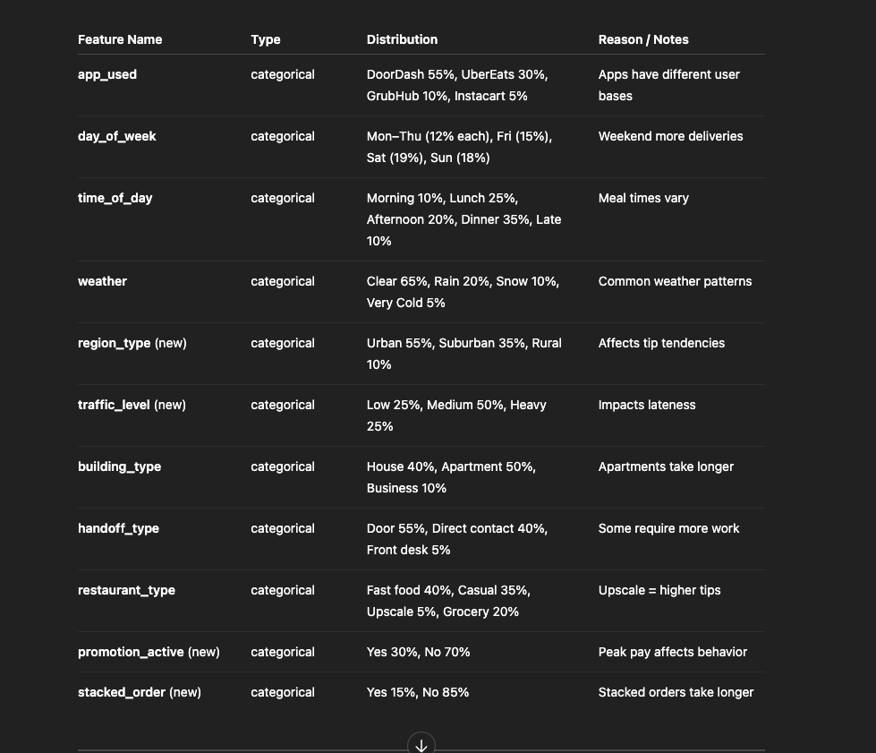
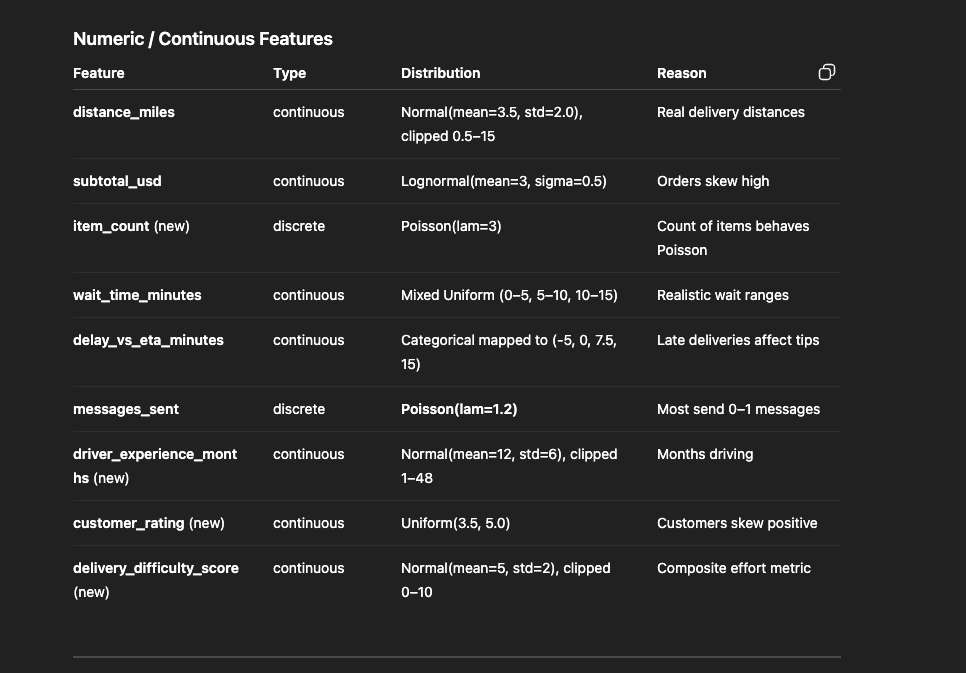
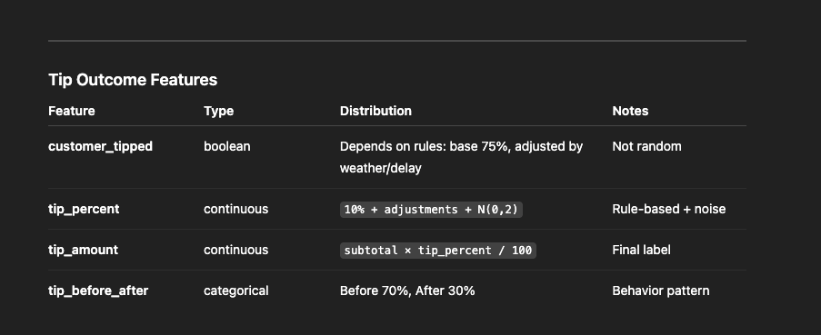

# Synthetic Data 

- Syntheic data is **data that is artifically created rather than data collected from real people or real events.**
- You might think this is fake data that is useless but its not. 

- SO synethic data is derived from exisiting datasets or models to replicate the characterisitcs of real world data. 
    - So its not just some random data but instead it is generated with rules that make it behave like real data.

- We use synthetic data when data is sparse or hard to obtain due to it being private.
- Synthetic data is cheap and easy to produce.

- So why not just use synthetic data, and why even bother with real world data. 
- One of the problem with synthetic data is that it cannot accuractly replicat the unexpected events that happen in the real world, which can affect the model's performance. 

- A real world example where synthetic data is used is in games.
- When a self-driving car model is trained on simulated (fake) pedestrians, buildings, and cars — that’s synthetic data.
- But the patterns are realistic:
    - pedestrians move slower than cars
    - red lights stop cars
    - bicycles swerve unpredictably
- The model still learns something meaningful.

## Types of Synthetic data 
 
1. Rule Based Synethic data is where you define: 
    - distrubutions
    - ranges
        - distance is between 0.1–15 miles”
    - rules 
        - rain increases tips by ~2%
    - noise
- Want to use this when you have no data. 
- Its is fully controlled data. 
- But one of the weakness is that this may not capture extremely subtle real-world patterns.

2. **Sample-Driven Synthetic Data** is when you start off with small dataset and use it to estimate: 
    - means
    - standard deviateions
    - categroical frequiences
    - correlation 
- So then you can generate more data using the patterns learned from the smaller dataset you already had. 
- The benefit is that it is more relasitic that rule based 
- BUt the problem is if the real sample is too small or biased, the synthetic data copies the bias. 

3. **Model-Generated Synthetic Data** uses ML models to create synthetic data. 
- The benfit is that these synthetic data are very realistic and can mimic complex patterns
- But it can be very hard to train as you need alot of real life data to train it. 
    - SO if you have no real life data then you cannot train it. 

- Since we only have 6 reponses, we will choose rule based. 
    - BUt that that doesnt mean our 6 reponses will go to waste, as they will help us set realistic ranges and approximate typical values.

## Choosing realistic distributions for synthetic data.

- A **distrubution** describes how a variable behaves:
    - which values are common/ rare
    - What values are clustered vs spread out 
    - is the data symmetric or swked 

- Types of distrubution includes:
    - Normal distibution are bell curves
        - useful for things that cluster over an average
        - such as distance, driver wait time, travel time
    - lognormal distribution are skwed to the right
        - useful for things that cannot be negaitve but rarely have negative values 
        - such as order total or even tip amount. 
    - Unifrom distrubution is when every value in a range has the same chance of happening. 
        - Ex pick a random number from 1 to 5, 1 has 20%, 2 has 20%, 3 has 20%, etc
        - No value is more common than another.
        - customer tips
    - categorical distribution is when you choose from a range of categories instead of numbers.
        - and you get to define the probablilty for each. 
        - Some things naturally happen more often than others.
        - Ex. Weather can be clear, rain, or cold and rain can have 30% while clear can be 60% as clear is more common than rain. 
    - Poisson distrubution is used for counting things.
        - It matches how counts behave in real life:
            - customers rarely order 20 items
            - customers often order 2–4
            - Poisson nails that pattern.
        - useful for Useful for messages sent

- Choosing the correct distrubution for the features is very important as it makes your synthetic data: 
    - realistic
    - believable
    - correct 
    - and useful for ML models

- These are the features and its dribution we will be using
- 
- 
- 

## how to build realistic correlations
- This is probably the most important step when it comes to building your synthetic dataset. 
- Defining correlation is what makes synethic data act like real life data.
- A correlation is a relationship where one variable influences another. 

- The types of correlation inlcude: 
    - linear correlation: when one varibale goes up another one goes up as well or when one vairbale decreases, the other one does as well
        - wait_time ↑ → tip_percent ↓
        - order_subtotal ↑ → tip_amount ↑
    - conditional correlation: A relationship that depends on categories.
        - ex if weather == "rain": add +2% to tip
    - Nonlinear correlation
        - ex tips go up when subtotal increases, but not forever
        - long-distance deliveries sometimes get zero tips
        - helps us add randomness 